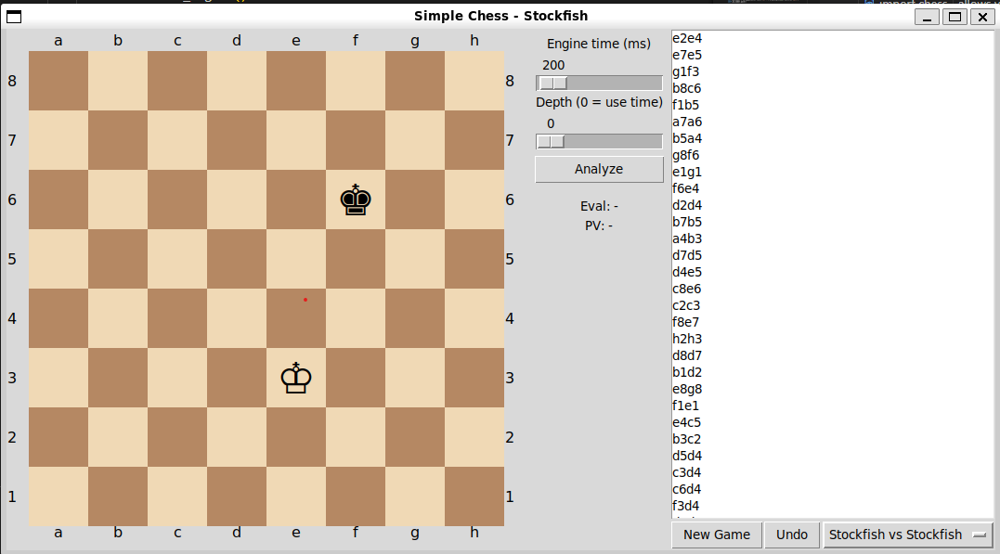

# The Unstoppable Force vs. The Immovable Object

Welcome to the digital arena where titans clash, where silicon brains compute billions of moves per second, and where the result is... always the same.

This is a tribute to the beautiful, perfect, and utterly predictable game of Stockfish vs. Stockfish.

### The Epic Saga

*   **White:** "I have calculated 40 moves ahead and found the optimal path to victory."
*   **Black:** "Fascinating. I have also calculated 40 moves ahead and found the optimal path to ensure you don't."
*   **Result:** A digital handshake, a shared byte of data, and a perfect `0.5 - 0.5` score.

It's the chess equivalent of `while(true) { draw; }`.

So sit back, relax, and marvel at the sheer perfection of a game where the only winning move is... to be Stockfish.